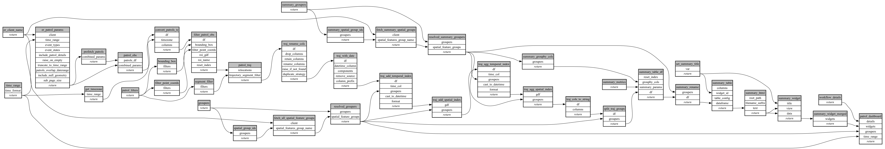

```
# AUTOGENERATED BY ECOSCOPE-WORKFLOWS; see fingerprint in README.md for details

```

```yaml
# fingerprint:
artifacts_sha256_basic: 7397ce941e0eeafd44516d748dcba0f3be75c9d050a2caaf2a7e2e1cb40859fc
artifacts_sha256_strict: 4759df3f3304ccf56591fb69940895fb6d8a32ede895e797325a6a5d174e91d6
installed_requirements:
- channel: https://repo.prefix.dev/ecoscope-workflows/
  name: ecoscope-platform
  version: {version: ==2.18.3}
- channel: conda-forge
  name: pydeck
  version: {version: ==0.9.2}
params_sha256: 1cc93a7adca1a8692852195e2cf53c51156786ab1e7739bebd9d27b921aa5e92
spec_sha256: c75104e24ebb167ca076c014284f8c774843c67d1ee78112b513f15924dbd71c

```

# ecoscope-workflows-patrol-effort-table-workflow


